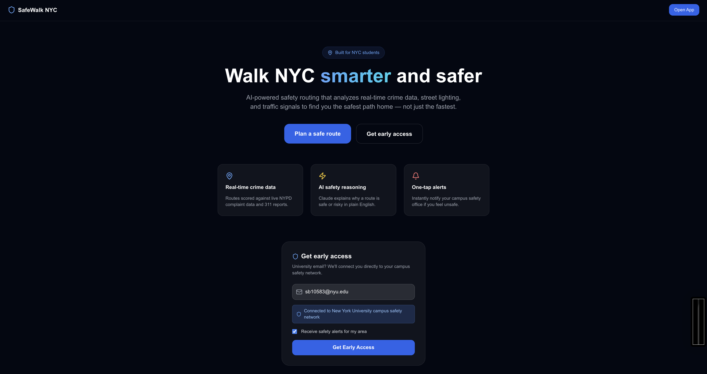
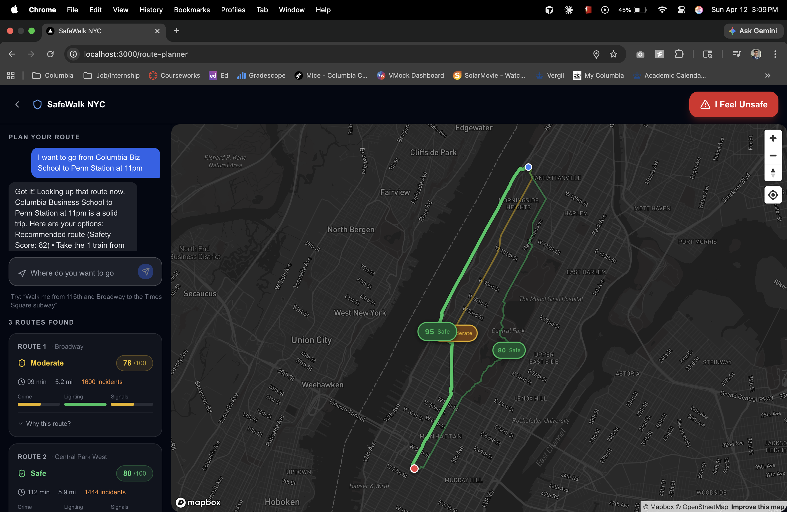
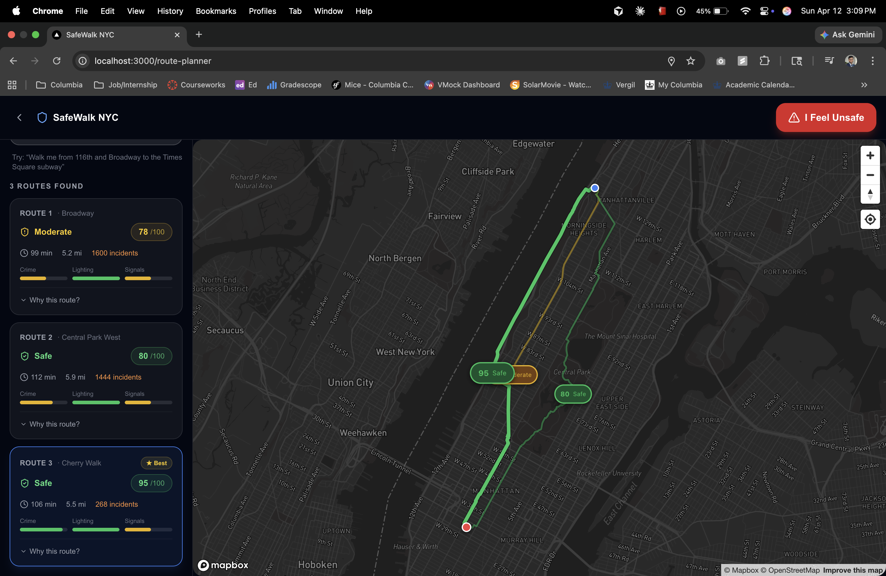

# SafeWalk NYC 🗽

> **AI-powered pedestrian safety routing for New York City** — built for students walking at night.

SafeWalk NYC combines real-time crime data, streetlight complaints, traffic signal density, and live news alerts to score walking routes 0–100. Claude AI explains the recommendation in plain English so users make informed decisions, not just fast ones.

---

## Screenshots

### Landing Page


### Route Planner — Conversational Input


### Route Results — 3 Scored Alternatives


---

## Demo

```
User: "Walk me from 3009 Broadway to Times Square"

┌─────────────────────────────────────────────────────────────────┐
│  3 ROUTES FOUND              RECOMMENDED: Route 1               │
│                                                                 │
│  Route 1  ★ Best    98/100 Safe    via Broadway      3.97 mi    │
│  Route 2            98/100 Safe    via Central Park  4.74 mi    │
│  Route 3            97/100 Safe    via Riverside     4.43 mi    │
│                                                                 │
│  "Route 1 via Broadway is your best option — zero crime         │
│   incidents, shortest at 3.97 mi, well-traveled corridor."     │
└─────────────────────────────────────────────────────────────────┘
```

All 3 routes appear on the Mapbox map simultaneously, each color-coded by safety score with floating score badges.

---

## Features

- **Conversational input** — describe your destination naturally; Claude parses intent into street addresses
- **3 route alternatives** — direct path + two corridor variants (east/west) scored independently
- **Live safety data** — NYPD crime reports (90-day window), NYC 311 lighting complaints, traffic signal density
- **Real-time news** — Linkup API surfaces construction closures and safety alerts near your route
- **Score badges on map** — all 3 routes visible simultaneously with floating score chips
- **Per-route cards** — each card shows its distinguishing corridor, Crime/Lighting/Signal bars, and an expandable explanation
- **Time-aware scoring** — same street scores lower at 2 AM (×2.0) than at noon (×1.0)
- **Campus safety alerts** — "I feel unsafe" button routes to Columbia, NYU, Barnard, or 911

---

## Architecture

### Full Request Pipeline

```
User message  (e.g. "Walk me from 3009 Broadway to Times Square")
     │
     ▼
┌──────────────────────────────────────┐
│  Step 1 — Claude: Parse Intent       │
│                                      │
│  Extracts origin + destination as    │
│  precise street addresses.           │
│  "Columbia Biz School" → "665 W 130th St"
└───────────────────┬──────────────────┘
                    │
                    ▼
┌──────────────────────────────────────┐
│  Step 2 — Geocoding (parallel)       │
│                                      │
│  Mapbox Geocoding v5                 │
│  • types: address, poi, neighborhood │
│  • bbox: NYC boroughs only           │
│  • NYC coordinate validation         │
│                                      │
│  Nominatim (OSM) fallback            │
│  • handles institutional POIs        │
│  • viewbox: NYC, bounded=1           │
└───────────────────┬──────────────────┘
                    │  origin + dest coordinates
                    ▼
┌──────────────────────────────────────────────────────────┐
│  Step 3 — Mapbox Directions  (3 parallel requests)       │
│                                                          │
│  Request A:  direct route          (no waypoint)         │
│  Request B:  eastern variant       (mid + perp × 0.012°) │
│  Request C:  western variant       (mid − perp × 0.012°) │
│                                                          │
│  Deduplicate by 2nd-most-prominent street + distance     │
│  → up to 3 distinct MapboxRoute objects                  │
└──────────────────────────┬───────────────────────────────┘
                           │
                           ▼
┌──────────────────────────────────────────────────────────┐
│  Step 4 — Segment Splitting  (~200 m chunks)             │
│                                                          │
│  Each Mapbox step → RouteSegment { start, end, geom }    │
│  Shared endpoint deduplication                           │
└──────────────────────────┬───────────────────────────────┘
                           │
                           ▼
┌──────────────────────────────────────────────────────────┐
│  Step 5 — Data Enrichment  (per segment, all parallel)   │
│                                                          │
│   ┌─────────────────┐  ┌─────────────────┐  ┌─────────┐ │
│   │  NYPD Crimes    │  │  311 Lighting   │  │ Traffic │ │
│   │  250 m radius   │  │  150 m radius   │  │ Signals │ │
│   │  90 days back   │  │  open only      │  │ 150 m   │ │
│   │  5uac-w243      │  │  erm2-nwe9      │  │ e5mv-wy8│ │
│   └─────────────────┘  └─────────────────┘  └─────────┘ │
│                                                          │
│   + Linkup news (once per route, at route midpoint)      │
│     → construction closures, crime alerts, detours       │
└──────────────────────────┬───────────────────────────────┘
                           │
                           ▼
┌──────────────────────────────────────────────────────────┐
│  Step 6 — Safety Scoring                                 │
│                                                          │
│  Per segment:                                            │
│    crimePenalty    = Σ(crime × severity) [FELONY=10]    │
│    lightPenalty    = openComplaints × 8  [cap 40]       │
│    signalPenalty   = 0/5/15 for ≥2/1/0 signals          │
│    newsPenalty     = Σ severity         [cap 15]        │
│                                                          │
│    raw    = crime×0.35 + light×0.25                      │
│             + signal×0.15 + news×0.10                    │
│    score  = 100 − raw × timeModifier                     │
│                                                          │
│  timeModifier:  06–20h ×1.0 · 20–24h ×1.5               │
│                 00–04h ×2.0 · 04–06h ×1.3               │
│                                                          │
│  Route score = distance-weighted avg of segments         │
└──────────────────────────┬───────────────────────────────┘
                           │
                           ▼
┌──────────────────────────────────────────────────────────┐
│  Step 7 — Claude: Explanation                            │
│                                                          │
│  Summarises all 3 routes, recommends the best by name,  │
│  cites crime counts, lighting issues, worst block.       │
└──────────────────────────┬───────────────────────────────┘
                           │
                           ▼
                    API Response
          { routes[], recommended, explanation }
```

---

### Safety Score Breakdown

```
                  Crime (35%)        Lighting (25%)
                      │                   │
        NYPD data ────┤        311 data ──┤
        90 days       │        open only  │
        250 m         │        150 m      │
                      ▼                   ▼
                 crimePenalty        lightPenalty
                      │                   │
                      └────────┬──────────┘
                               │
              Signal (15%) ────┤◄── Traffic signals 150 m
              News   (10%) ────┤◄── Linkup alerts/closures
                               │
                               ▼
                    raw = weighted sum
                               │
                               ▼
                   score = 100 − raw × T
                               │
               ┌───────────────┼───────────────┐
               ▼               ▼               ▼
           T = 1.0         T = 1.5         T = 2.0
          (6 AM–8 PM)    (8 PM–midnight)  (midnight–4 AM)

Score labels:  ≥ 80  🟢 Safe
               ≥ 60  🟡 Moderate
               ≥ 40  🟠 Use Caution
                < 40  🔴 High Risk
```

---

### Frontend Data Flow

```
route-planner/page.tsx
        │
        │  User types destination
        ▼
ChatInput.tsx ──POST /api/chat──► Claude (conversational)
        │                               │
        │  onRouteExtracted(org, dst)   │ plain-text reply
        ▼                               ▼
handleRouteExtracted()          Chat bubble in sidebar
        │
        │  POST /api/score-route
        ▼
ApiResponse { routes[], recommended, explanation }
        │
        ├──► MapView.tsx  (Mapbox GL JS, SSR: false)
        │     • All 3 polylines drawn simultaneously
        │     • Color by score: green / yellow / orange / red
        │     • Selected route: opacity 1.0, width 6 px
        │     • Others: opacity 0.45, width 3 px
        │     • Score badge (pill) at each route midpoint
        │     • Origin (blue dot) + Destination (red dot)
        │     • Camera fits all routes on load
        │
        └──► RouteCard.tsx  ×3  (one per route)
              • "Route N  ·  via [street]"
              • ★ Best badge on recommended
              • Safety score + Shield icon
              • Duration · Distance · Incidents
              • Crime / Lighting / Signals progress bars
              • Expandable explanation
                - Recommended → full Claude narrative
                - Others      → auto-generated from data
```

---

## File Structure

```
safewalk-nyc/
├── app/
│   ├── page.tsx                    Landing page with email signup
│   ├── layout.tsx                  Root layout — loads globals.css
│   ├── globals.css                 Mapbox CSS + Tailwind directives
│   ├── route-planner/
│   │   └── page.tsx                Main app: map + chat sidebar
│   └── api/
│       ├── score-route/route.ts    POST — full 7-step scoring pipeline
│       ├── chat/route.ts           POST — conversational assistant
│       └── alert/route.ts          POST — campus safety alert routing
│
├── components/
│   ├── MapView.tsx                 Mapbox GL map (dynamic import, SSR false)
│   ├── RouteCard.tsx               Per-route card with safety bars
│   ├── ChatInput.tsx               Conversational input + message history
│   ├── AlertButton.tsx             Persistent "I feel unsafe" button
│   └── SignupForm.tsx              Email signup with university detection
│
├── lib/
│   ├── types.ts                    All shared TypeScript interfaces
│   ├── scoring.ts                  scoreSegment() · scoreRoute() · scoreLabel()
│   ├── alert-routing.ts            Email domain → campus safety contacts
│   └── api/
│       ├── nyc-open-data.ts        NYPD · 311 · traffic signal fetchers
│       ├── linkup.ts               Linkup search + news penalty calculator
│       └── claude.ts               Anthropic SDK wrappers
│
├── .env.local.example              Required environment variables template
├── CLAUDE.md                       Project conventions (AI-assisted coding)
└── README.md
```

---

## Tech Stack

| Layer | Technology |
|-------|-----------|
| Framework | Next.js 14 — App Router, TypeScript |
| Styling | Tailwind CSS |
| Map | Mapbox GL JS (dynamic import, SSR disabled) |
| AI | Anthropic Claude `claude-sonnet-4-6` |
| Crime data | NYC Open Data — NYPD Complaints `5uac-w243` |
| Lighting data | NYC Open Data — 311 Service Requests `erm2-nwe9` |
| Signal data | NYC Open Data — Traffic Signals `e5mv-wy8f` |
| News alerts | Linkup API |
| Geocoding | Mapbox Geocoding v5 + Nominatim (OSM) fallback |
| Routing | Mapbox Directions v5 — 3 variants via forced waypoints |

---

## Getting Started

### 1. Clone and install

```bash
git clone https://github.com/Tanmay244/safewalk-nyc.git
cd safewalk-nyc
npm install
```

### 2. Configure environment variables

```bash
cp .env.local.example .env.local
```

Edit `.env.local`:

```env
ANTHROPIC_API_KEY=sk-ant-...          # console.anthropic.com
LINKUP_API_KEY=...                    # linkup.so
NEXT_PUBLIC_MAPBOX_TOKEN=pk.eyJ...    # mapbox.com
```

### 3. Run dev server

```bash
npm run dev
# → http://localhost:3000
```

Navigate to `/route-planner` and try:

```
Walk me from 3009 Broadway to Times Square
```

You should see 3 routes on the map with safety score badges.

---

## API Reference

### `POST /api/score-route`

Score 3 walking route alternatives between two NYC addresses.

**Request body**
```json
{
  "message": "Walk me from 3009 Broadway to Times Square",
  "userLocation": { "lat": 40.8095, "lng": -73.9634 }
}
```

**Response**
```json
{
  "routes": [
    {
      "path": { "type": "LineString", "coordinates": [[...]] },
      "score": 98,
      "scoreLabel": { "label": "Safe", "color": "green" },
      "distanceMiles": 3.97,
      "durationMinutes": 74,
      "label": "via Broadway",
      "segments": [
        {
          "streetName": "Broadway",
          "score": 98,
          "crimePenalty": 0,
          "lightingPenalty": 4,
          "trafficSignalPenalty": 0,
          "crimeCount": 0,
          "openLightingIssues": 1,
          "nearbySignals": 3
        }
      ]
    }
  ],
  "recommended": 0,
  "explanation": "Route 1 via Broadway is your best option...",
  "origin": { "lat": 40.8095, "lng": -73.9634 },
  "destination": { "lat": 40.7580, "lng": -73.9855 },
  "timeOfDay": 13
}
```

### `POST /api/chat`

Conversational assistant for safety questions and route queries.

**Request**
```json
{
  "messages": [{ "role": "user", "content": "Is it safe to walk at midnight?" }],
  "context": { "currentLocation": "Columbia University" }
}
```

**Response**
```json
{
  "reply": "Walking late at night has some risks worth knowing...",
  "route": { "origin": "Columbia University", "destination": "Penn Station" }
}
```

### `POST /api/alert`

Route a safety alert to campus security or emergency contacts.

**Request**
```json
{
  "email": "student@columbia.edu",
  "location": { "lat": 40.8075, "lng": -73.9626 },
  "message": "I feel unsafe near 120th and Amsterdam"
}
```

---

## University Safety Contacts

Email domain detection automatically routes alerts to the right team.

| University | Domain | Emergency |
|-----------|--------|-----------|
| Columbia University | `columbia.edu` | 212-854-5555 |
| NYU | `nyu.edu` | 212-998-2222 |
| Barnard College | `barnard.edu` | Barnard Security |
| The New School | `newschool.edu` | Campus Safety |
| Fordham University | `fordham.edu` | Fordham Security |

**Adding a university** — append to `UNIVERSITIES` in `lib/alert-routing.ts`:

```ts
{ name: "My University", domain: "myuni.edu", safetyEmail: "safety@myuni.edu", color: "#3b82f6" }
```

---

## Score Reference

| Score | Label | Meaning |
|-------|-------|---------|
| 80–100 | 🟢 Safe | Well-lit, low crime, good pedestrian signals |
| 60–79 | 🟡 Moderate | Some concerns; take normal precautions |
| 40–59 | 🟠 Use Caution | Elevated risk; stay aware of surroundings |
| 0–39 | 🔴 High Risk | Avoid if possible, especially at night |

Scores are **time-adjusted** — the same block is scored lower after dark:

```
06:00 – 20:00  ×1.0  (baseline)
20:00 – 24:00  ×1.5  (evening penalty)
00:00 – 04:00  ×2.0  (night penalty)
04:00 – 06:00  ×1.3  (pre-dawn penalty)
```

---

## Roadmap

- [ ] Real-time MTA transit alerts → route avoidance
- [ ] Email delivery for safety alerts (Resend / SendGrid)
- [ ] Persist signups to Supabase
- [ ] Rate limiting via `@upstash/ratelimit`
- [ ] User accounts + saved routes
- [ ] Mobile app (React Native / Expo)

---

## Contributing

Pull requests welcome. For major changes, open an issue first.

---

## License

MIT — built for NYC students who deserve to feel safe getting home.
